# AWS NASA Solar Radiation ETL Pipeline

## Project Overview

This project is a serverless AWS ETL pipeline that ingests NASA POWER climate and solar radiation data for Canadian cities, transforms nested API responses into analytics-ready Parquet files, catalogs the data using AWS Glue, and queries the final dataset using Amazon Athena.

The project analyzes daily solar radiation, temperature, humidity, wind speed, and precipitation for Calgary, Saskatoon, and Toronto. The final Athena dataset is used to create solar energy analytics, custom solar suitability scoring, correlation analysis, rolling averages, and ML-ready time-series features.

## Tech Stack

* **AWS Lambda** – API ingestion and JSON-to-Parquet ETL
* **Amazon S3** – raw JSON storage and processed Parquet data lake
* **Amazon EventBridge Scheduler** – daily automated ingestion
* **AWS Glue Crawler** – schema discovery and Data Catalog updates
* **Amazon Athena** – SQL analytics on partitioned Parquet data
* **Python** – Lambda development
* **pandas / AWS SDK for pandas** – data transformation
* **Excel** – heat map and chart visualization
* **NASA POWER API** – climate and solar radiation data source

## Data Source

The pipeline uses the **NASA POWER API** to collect daily climate and solar radiation data.

The main solar radiation variable used is:

```text
ALLSKY_SFC_SW_DWN
```

This represents all-sky surface shortwave downward irradiance.

The unit is:

```text
kWh/m²/day
```

This means kilowatt-hours of solar energy received per square meter per day.

## Pipeline Architecture

The pipeline follows this workflow:

1. **EventBridge Scheduler** runs the NASA ingestion Lambda on a daily schedule.
2. **NASA API ingestion Lambda** calls the NASA POWER API for selected Canadian cities.
3. The Lambda checks for NASA missing-data fill values such as `-999.0`.
4. Valid raw JSON files are saved to Amazon S3 under the raw landing zone.
5. An **S3 object-created trigger** invokes the ETL Lambda.
6. The ETL Lambda flattens nested NASA JSON data into a tabular format.
7. The transformed data is written back to S3 as partitioned Parquet files.
8. An **AWS Glue Crawler** catalogs the Parquet data.
9. **Amazon Athena** queries the final data lake table.
10. Athena results are exported to Excel for visualization.

## Architecture Diagram


## S3 Data Lake Structure

Raw NASA API JSON files are stored separately from processed Parquet files.

```text
s3://adi-elt-project/nasa_json_incoming/
s3://adi-elt-project/nasa_parquet_datalake/
```

The processed Parquet data is partitioned by city, year, and month.

```text
nasa_parquet_datalake/
  city=toronto/
    year=2026/
      month=06/
      month=07/
```

This structure helps organize the data and allows Athena to query partitioned files efficiently.

## AWS Pipeline Screenshots

### S3 Raw JSON Landing Zone

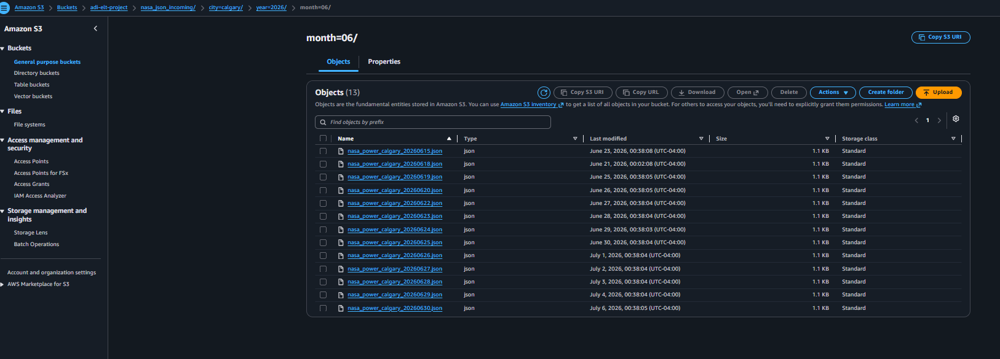

This screenshot shows the raw JSON files ingested from the NASA POWER API into Amazon S3.

### S3 Partitioned Parquet Data Lake

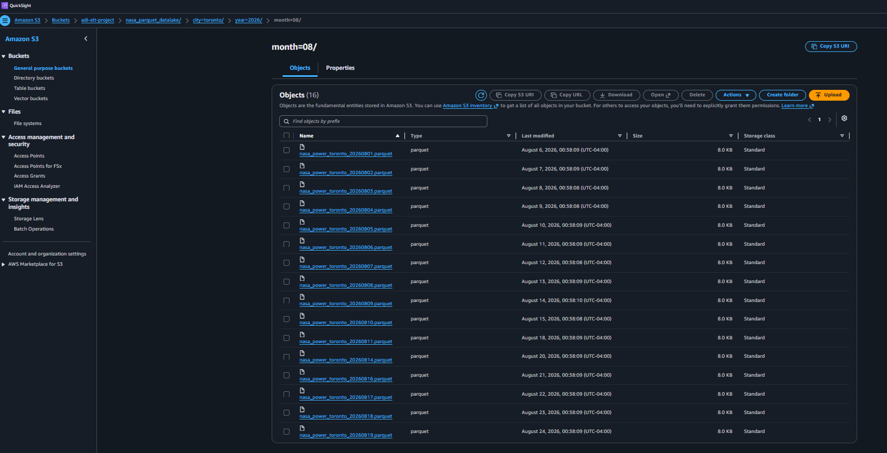

This screenshot shows the processed Parquet data stored in a partitioned S3 structure by city, year, and month.

### EventBridge Daily Schedule


This screenshot shows the EventBridge schedule used to automatically run the NASA ingestion Lambda daily.

### Glue Crawler Success

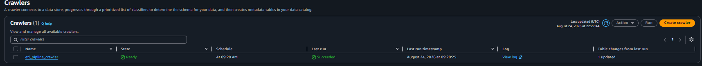

This screenshot shows the AWS Glue crawler successfully creating or updating the Athena table metadata.

### Athena Query Editor

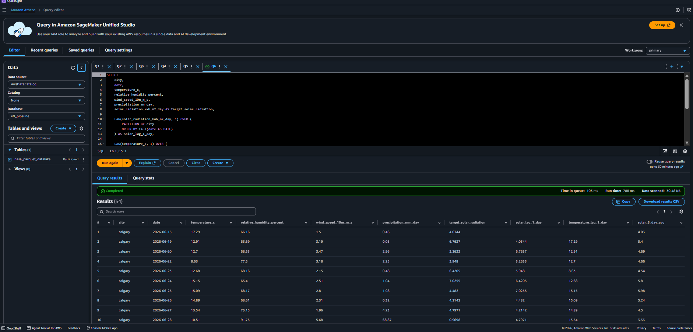

This screenshot shows Athena querying the final Glue Data Catalog table.

## Athena Analytics

### Q1: Solar Suitability Score

This query creates a custom solar suitability score using solar radiation, precipitation, and temperature.

```sql
SELECT 
    date,
    city,
    temperature_c,
    precipitation_mm_day,
    solar_radiation_kwh_m2_day,
    ROUND(
        (solar_radiation_kwh_m2_day * 10)
        - (precipitation_mm_day * 0.5)
        + CASE 
            WHEN temperature_c BETWEEN 15 AND 28 THEN 5
            ELSE 0
          END,
        2
    ) AS solar_suitability_score
FROM "AwsDataCatalog"."etl_pipeline"."nasa_parquet_datalake"
ORDER BY solar_suitability_score DESC;
```

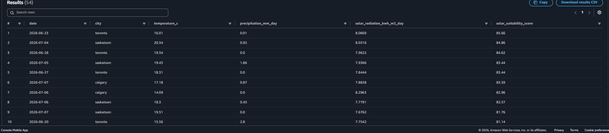

This query ranks city-date combinations by solar energy potential. Higher scores represent stronger solar radiation, lower precipitation, and favorable temperatures.

### Q2: City-Level Solar Summary

This query compares average solar radiation and average temperature across cities.

```sql
SELECT 
    city,
    ROUND(AVG(solar_radiation_kwh_m2_day), 2) AS avg_solar_radiation,
    ROUND(AVG(temperature_c), 2) AS avg_temperature,
    COUNT(*) AS days_analyzed
FROM "AwsDataCatalog"."etl_pipeline"."nasa_parquet_datalake"
GROUP BY city
ORDER BY avg_solar_radiation DESC;
```


This result summarizes average solar radiation by city and helps compare overall solar potential between Calgary, Saskatoon, and Toronto.

### Q3: Rain and Solar Radiation Correlation

This query calculates the relationship between precipitation and solar radiation.

```sql
SELECT 
    city,
    ROUND(CORR(precipitation_mm_day, solar_radiation_kwh_m2_day), 3) AS rain_solar_correlation
FROM "AwsDataCatalog"."etl_pipeline"."nasa_parquet_datalake"
GROUP BY city
ORDER BY rain_solar_correlation;
```

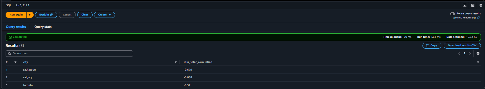

The results show a negative correlation between precipitation and solar radiation. This means that days with more precipitation generally have lower solar radiation.

### Q4: Three-Day Moving Average

This query creates a three-day moving average of solar radiation using Athena SQL window functions.

```sql
SELECT 
    date,
    city,
    solar_radiation_kwh_m2_day,
    ROUND(
        AVG(solar_radiation_kwh_m2_day) OVER (
            PARTITION BY city 
            ORDER BY CAST(date AS DATE)
            ROWS BETWEEN 2 PRECEDING AND CURRENT ROW
        ), 
        2
    ) AS solar_3_day_moving_avg
FROM "AwsDataCatalog"."etl_pipeline"."nasa_parquet_datalake"
ORDER BY city, date;
```

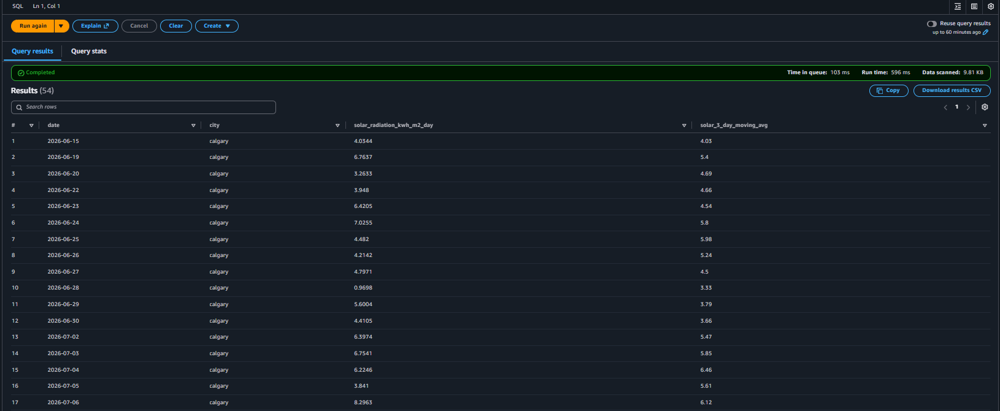

This query smooths daily solar radiation changes and supports time-series analysis.

### Q5: ML-Ready Feature Engineering Table

This query creates time-series features that could be used for a future solar radiation forecasting model.

```sql
SELECT  
    city, 
    date, 
    temperature_c, 
    relative_humidity_percent, 
    wind_speed_10m_m_s, 
    precipitation_mm_day, 
    solar_radiation_kwh_m2_day AS target_solar_radiation, 
 
    LAG(solar_radiation_kwh_m2_day, 1) OVER ( 
        PARTITION BY city  
        ORDER BY CAST(date AS DATE) 
    ) AS solar_lag_1_day, 
 
    LAG(temperature_c, 1) OVER ( 
        PARTITION BY city  
        ORDER BY CAST(date AS DATE) 
    ) AS temperature_lag_1_day, 
 
    ROUND( 
        AVG(solar_radiation_kwh_m2_day) OVER ( 
            PARTITION BY city  
            ORDER BY CAST(date AS DATE) 
            ROWS BETWEEN 2 PRECEDING AND CURRENT ROW 
        ), 
        2 
    ) AS solar_3_day_avg 
 
FROM "AwsDataCatalog"."etl_pipeline"."nasa_parquet_datalake" 
ORDER BY city, date;
```

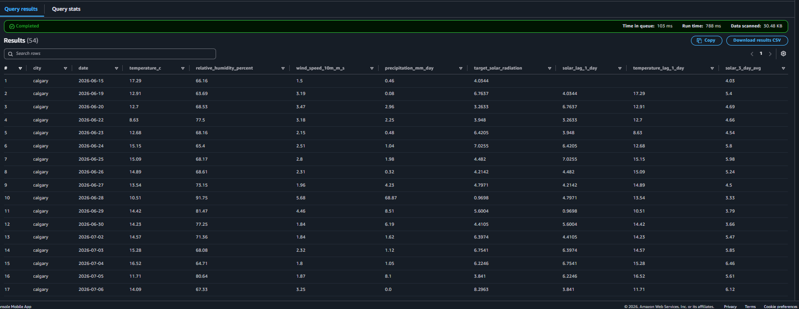

This query creates:

* `target_solar_radiation`: the value a future model could predict
* `solar_lag_1_day`: previous available solar radiation for the same city
* `temperature_lag_1_day`: previous available temperature for the same city
* `solar_3_day_avg`: rolling three-day average solar radiation

This demonstrates feature engineering using Athena SQL window functions.

## Excel Visualizations

Athena query results were downloaded as CSV files and visualized in Excel.

### Solar Radiation Heat Map by City and Date

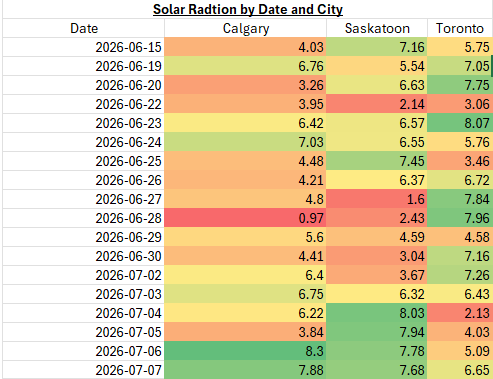

This heat map shows daily solar radiation values by city and date. Higher values indicate stronger solar energy potential.

### Solar Radiation by Date and City

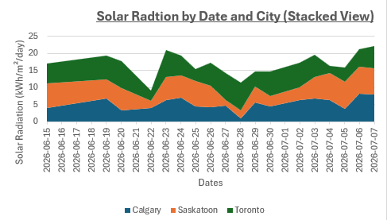

This stacked chart shows daily solar radiation trends across Calgary, Saskatoon, and Toronto.

### Daily Solar Radiation vs. Three-Day Moving Average

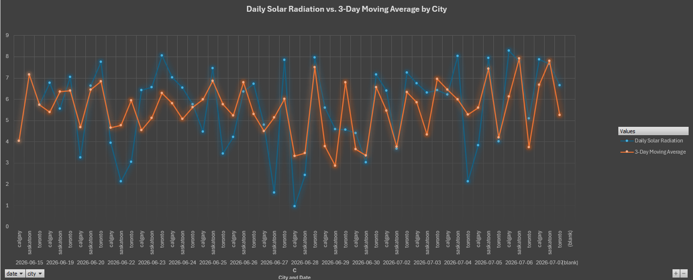

This chart compares raw daily solar radiation with a three-day moving average. The moving average smooths short-term weather variation and makes the trend easier to interpret.

## Key Insights

* Toronto had the highest average solar radiation in the analyzed period.
* All cities showed a negative relationship between precipitation and solar radiation.
* The custom solar suitability score identified high-potential solar days based on radiation, precipitation, and temperature.
* Athena SQL window functions were used to create time-series features such as lag variables and rolling averages.
* The AWS pipeline successfully automated ingestion, transformation, cataloging, and querying of NASA POWER data.

## Skills Demonstrated

This project demonstrates:

* Serverless AWS data engineering
* REST API ingestion with AWS Lambda
* S3-based data lake design
* JSON-to-Parquet transformation
* Partitioned Parquet storage
* AWS Glue Data Catalog integration
* Amazon Athena SQL analytics
* EventBridge automation
* Missing-data validation
* SQL aggregation and correlation analysis
* SQL window functions
* Time-series feature engineering
* Data visualization using Excel

## Future Improvements

Future improvements could include:

* Adding more Canadian cities
* Creating a larger historical backfill
* Building a Streamlit dashboard
* Training a machine learning model to forecast solar radiation
* Automating visualization generation with Python
* Deploying infrastructure using Terraform or AWS SAM

## Resume Bullet

Built a serverless AWS ETL pipeline using EventBridge, Lambda, S3, Glue, and Athena to ingest NASA POWER climate data, validate missing API values, transform nested JSON into partitioned Parquet, and run SQL-based solar energy analytics with heat maps, custom suitability scoring, correlation analysis, and ML-ready time-series features.
